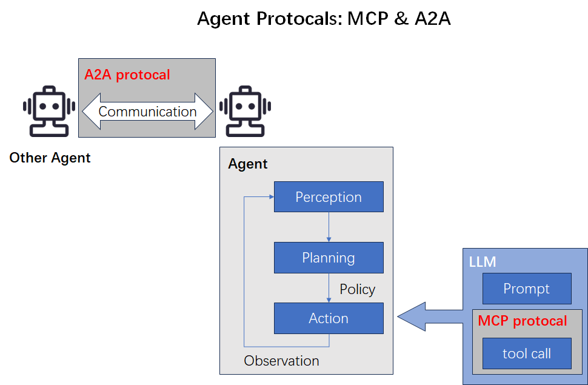

2025年4月9日，Google提出Agent领域又一个重磅的协议A2A(Agent2Agent)。

面向场景：多智能体交互的对话框架。值得注意的是，Google突出强调这一协议的ToB前景——**Enterprise Readiness。**

A2A具体是什么，它与当前炙手可热的MCP(Model Context Protocol)又有怎么样的关联呢？

## A2A 与 MCP

A2A的官方文档中有介绍[A2A与MCP](https://google.github.io/A2A/#/topics/a2a_and_mcp)相关内容，但这里笔者想用自己的语言尝试直观解释。

